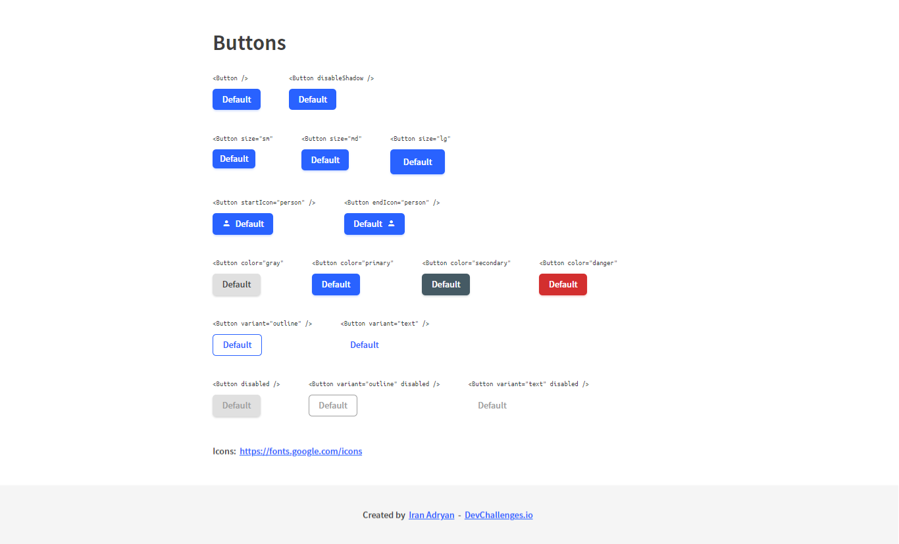

<h1 align="center">Button Component</h1>

   Solution for a challenge from  <a href="http://devchallenges.io" target="_blank">Devchallenges.io</a>.

  <h3>
    <a href="https://iranadryan.github.io/dc-button-component">
      Demo
    </a>
     | 
    <a href="https://github.com/iranadryan/dc-button-component">
      Solution
    </a>
     | 
    <a href="https://devchallenges.io/challenges/ohgVTyJCbm5OZyTB2gNY">
      Challenge
    </a>
  </h3>

## Overview

The challenges was basically create a button component with some variations, different sizes and colors. In the demo you'll see all stuff created a their code to use.

### Built With

- [React](https://reactjs.org/)
- [Styled Components](https://styled-components.com/)

## Contact

- LinkedIn: [in/iranbatista](https://www.linkedin.com/in/iranbatista/)
- DevChallenges: [iranadryan](https://devchallenges.io/portfolio/iranadryan)
